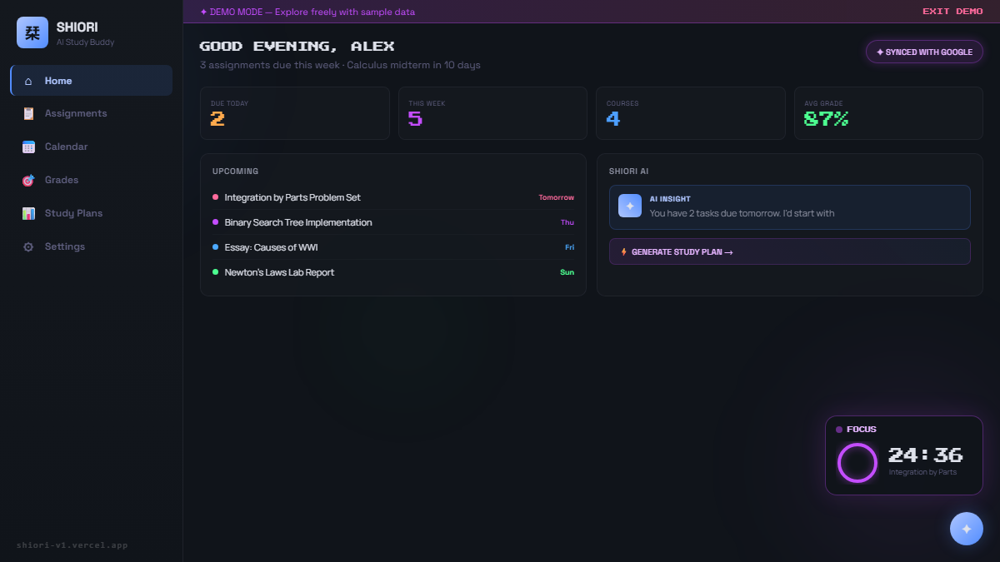

<div align="center">

<h1>栞 Shiori</h1>

### *The open-source AI study companion students actually use*

> **Shiori** (栞) means *bookmark* in Japanese — because every deadline deserves to be remembered.

[](LICENSE)
[](https://react.dev/)
[](https://aistudio.google.com/)
[](https://github.com/kaorii-ako/Shiori-v1/blob/master/.github/CONTRIBUTING.md)
[](https://github.com/kaorii-ako/Shiori-v1/stargazers)
[](https://vercel.com/new/clone?repository-url=https://github.com/kaorii-ako/Shiori-v1)

<br/>

**[🚀 Live Demo — no signup required →](https://shiori-v1.vercel.app)**

<br/>

[](https://shiori-v1.vercel.app)

<br/>

> **15 pages · AI quiz generator · SRS flashcards · GPA predictor · Pomodoro · Leaderboard · PWA**

<br/>

**[⭐ Star on GitHub](https://github.com/kaorii-ako/Shiori-v1)** &nbsp;·&nbsp; **[🚀 Try Demo](https://shiori-v1.vercel.app)** &nbsp;·&nbsp; **[🤖 MCP Server](mcp/)** &nbsp;·&nbsp; **[🧩 Chrome Extension](extension/)** &nbsp;·&nbsp; **[📝 dev.to Article](https://dev.to/kaoriiako/i-built-an-mcp-server-that-lets-claude-read-my-study-data-heres-how-5070)** &nbsp;·&nbsp; **[💜 Get Pro](https://shiori-v1.vercel.app/pro)** &nbsp;·&nbsp; **[🐛 Report Bug](https://github.com/kaorii-ako/Shiori-v1/issues)**

> 🤖 **New:** [Shiori MCP Server](mcp/) — use your study data directly in Claude Code. `"What's due this week?"` `"Show my grades"` `"Add assignment: essay due Friday"`

</div>

---

## 🌸 What is Shiori?

**Shiori is what Google Classroom should have been.**

It syncs your assignments from Google Classroom, hunts deadline emails in Gmail, and hands you an AI study plan powered by Gemini. Track grades with weighted categories, predict your final exam score, generate quizzes from your notes, import an entire semester from your syllabus in one paste, and share your GPA card in one click.

**Zero accounts required. Try the full app in 10 seconds with demo mode.**

```
┌───────────────────────────────────────────────────────────────────┐
│  Google Classroom  +  Gmail  +  Google Calendar                   │
│         ↓                ↓              ↓                         │
│                   Shiori AI (Gemini)                              │
│                          ↓                                        │
│  16 pages · AI quiz · SRS flashcards · GPA predictor · PWA       │
└───────────────────────────────────────────────────────────────────┘
```

### At a glance

| | Feature | What it does |
|---|---|---|
| 🤖 | **AI Study Plans** | Gemini builds a real day-by-day schedule from your deadlines |
| 📋 | **Syllabus Import** | Paste your syllabus → AI extracts every assignment instantly |
| 🧠 | **AI Quiz Generator** | Open a note → MCQ quiz with explanations in one click |
| 🃏 | **SRS Flashcards** | Anki-style spaced repetition, CSV/Quizlet import, AI card gen |
| 📊 | **GPA Predictor** | Weighted categories + "What score do I need on the final?" |
| 📝 | **Markdown Notes** | Per-course notes, AI summarizer, auto-save, export .md |
| 🏆 | **Leaderboard** | Compare study streaks with friends via shareable codes |
| ⏱ | **Focus Mode** | Fullscreen Pomodoro with ambient orbs + motivational quotes |
| 🔥 | **Habit Tracker** | Daily grid, streak tracking, confetti on full completion |
| 🧩 | **Chrome Extension** | Quick-add, Pomodoro, and Classroom import from any tab |
| 📱 | **PWA** | Install on mobile, works offline |
| 🎨 | **Dark / Light Mode** | Midnight study room or clean light mode |

> Your credentials stay local. No data harvesting. No mandatory subscriptions. MIT licensed.

---

## ✨ Features

### 📚 Assignment & Schedule Intelligence
| Feature | Description |
|---------|-------------|
| **Google Classroom Sync** | Pulls assignments and due dates the moment they're posted |
| **Gmail Intelligence** | Scans your inbox and surfaces buried deadline emails |
| **Calendar Integration** | Shows assignment deadlines as colored dots alongside your events |
| **iCal Export** | Export your assignments as `.ics` — opens in Google Calendar, Outlook, Apple Calendar |

### 🤖 AI-Powered Planning
| Feature | Description |
|---------|-------------|
| **AI Study Plans** | Gemini generates a real day-by-day schedule from your actual deadlines |
| **AI Chat** | Ask anything — Shiori knows your real assignments and schedule |
| **PDF Study Plan Export** | Export your AI-generated schedule as a branded PDF |
| **Smart Prioritization** | High/medium/low priority auto-assigned based on due date and estimated hours |

### 📊 Grade Tracking
| Feature | Description |
|---------|-------------|
| **Live GPA Dashboard** | Per-course grades, letter grades, and cumulative GPA calculated live |
| **Weighted Categories** | Set Homework 30% / Midterm 35% / Final 35% — GPA recalculates automatically |
| **Final Exam Predictor** | "What score do I need on the final to get an A?" — answered instantly |
| **Shareable GPA Card** | Generate a beautiful 900×520 PNG report card to share anywhere |

### 📝 Notes
| Feature | Description |
|---------|-------------|
| **Per-Course Notes** | Color-coded notes linked to each course |
| **Markdown Editor** | `**bold**`, `*italic*`, `` `code` ``, headings, lists — with live preview |
| **Auto-Save** | Notes save automatically 600ms after you stop typing |
| **Export as Markdown** | Download any note as a `.md` file |
| **Pin Notes** | Keep important notes at the top of your list |

### 🃏 Flashcards & Spaced Repetition
| Feature | Description |
|---------|-------------|
| **Flashcard Decks** | Create decks per course, add unlimited Q&A cards |
| **3D Card Flip** | Tap to reveal answer with a smooth 3D perspective animation |
| **Spaced Repetition (SRS)** | Cards you miss come back sooner; mastered cards push to 1d → 2d → 5d intervals |
| **Streak Tracking** | 3+ correct in a row = mastered 🏆; session stats shown after each study session |
| **AI Card Generation** | Click "AI CARDS" in Notes editor — Gemini reads your notes and creates Q&A flashcards instantly |
| **CSV Import** | Paste any tab/comma-separated text — works with Quizlet export, Anki CSV, or plain text |
| **Due-Now Counter** | Dashboard shows how many cards are ready for review |

### 🧠 AI Quiz Generator
| Feature | Description |
|---------|-------------|
| **Generate from Notes** | Open any note → click "Generate Quiz" — Gemini creates MCQ questions from your study material |
| **Paste Custom Text** | Paste any text and get a quiz in seconds |
| **5 / 8 / 10 questions** | Choose difficulty length |
| **MCQ with Explanations** | 4 options per question + AI explains why each answer is right or wrong |
| **Keyboard-driven** | Press 1–4 to select, Enter to confirm/advance |
| **Score History** | Quiz results saved locally — track improvement over time |
| **Score Ring Animation** | Animated circular progress ring on results screen |

### 🔥 Habit Tracker
| Feature | Description |
|---------|-------------|
| **Daily Habit Grid** | 7-day completion grid for any habit you want to build |
| **Streak Counter** | Per-habit fire emoji streak — don't break the chain |
| **Color-coded habits** | Pick a color per habit, add/delete freely |
| **Confetti celebration** | Complete all habits for the day → confetti burst 🎉 |

### ⏱️ Focus & Productivity
| Feature | Description |
|---------|-------------|
| **Pomodoro Timer** | Focus sessions tied to specific assignments, with session history |
| **Sound Notifications** | Distinct tones for focus→break and break→focus transitions (Web Audio, no downloads) |
| **Progress Share Card** | Canvas-rendered 900×500 PNG with your GPA, focus time, and completion rate — download and share |
| **Keyboard Shortcut Modal** | Press `?` anywhere for a full shortcut reference |
| **Keyboard Shortcuts** | `gh/ga/gc/gg/gs/gn/gf/gb/gq` to navigate, `Ctrl+K` for AI chat, `Ctrl+Shift+A` quick capture |

### 🎨 Design
| Feature | Description |
|---------|-------------|
| **Dark / Light Theme** | Toggle between midnight study room and clean light mode |
| **Midnight Study Room** | Dark glassmorphism with floating orbs — built for late-night sessions |
| **Framer Motion** | Smooth, purposeful animations throughout |
| **Custom fonts** | Space Grotesk headings · Manrope body · Press Start 2P retro accents |

- **Demo Mode** — full app with 5 courses, 10 assignments, grades, events — zero setup

---

## ⚡ Try it in 10 seconds

```
1. Visit https://shiori-v1.vercel.app
2. Click "TRY DEMO"
3. You're in — no account, no API keys, no setup
```

Demo mode loads: 5 courses · 10 assignments · grades with GPA calc · upcoming events · AI-generated study plan

---

## 🚀 Self-Host

### Prerequisites
- Node.js v18+
- npm v9+
- [Supabase](https://supabase.com) project (free tier) — for auth + database
- [Google Gemini API key](https://aistudio.google.com/app/apikey) (free) — for AI features
- Google Cloud project (optional) — for Classroom/Gmail/Calendar sync

### Setup

```bash
git clone https://github.com/kaorii-ako/Shiori-v1.git
cd Shiori-v1
npm install
cp .env.example .env
# Fill in your keys — see .env.example for the full guide
npm run dev
# Frontend: http://localhost:5173  |  Backend: http://localhost:3001
```

### Required environment variables

```env
VITE_SUPABASE_URL=       # From Supabase project Settings → API
VITE_SUPABASE_ANON_KEY=  # From Supabase project Settings → API
GEMINI_API_KEY=          # Google AI Studio (free) — or set in-app
GOOGLE_CLIENT_ID=        # Google OAuth 2.0 (optional, for Classroom sync)
GOOGLE_CLIENT_SECRET=
SESSION_SECRET=          # Any random 32+ char string
```

### Supabase setup (5 min)

1. Create a free project at [supabase.com](https://supabase.com)
2. Open **SQL Editor** → paste contents of [`supabase/schema.sql`](supabase/schema.sql) → **Run**
3. Go to **Auth → Providers** → enable **GitHub** and/or **Google**
4. Copy **Project URL** + **anon/public key** from **Settings → API** into `.env`
5. Done — auth + database ready

---

## 🛠 Tech Stack

| Layer | Technology |
|-------|------------|
| **Frontend** | React 18, Vite, Framer Motion, Tailwind CSS |
| **State** | Zustand + zustand/persist |
| **Backend** | Express.js (Node.js) |
| **Database** | Supabase (PostgreSQL + Auth + Row Level Security) |
| **AI** | Google Gemini 1.5 Flash |
| **Auth** | Supabase Auth — GitHub OAuth, Google OAuth, Email/Password |
| **Google APIs** | Classroom, Gmail, Calendar (optional) |
| **PDF** | jsPDF (client-side, no server needed) |
| **Icons** | Lucide React |

---

## 📁 Project Structure

```
Shiori-v1/
├── client/                    # React frontend (Vite)
│   └── src/
│       ├── components/        # GlassCard, Button, Sidebar, AIChat, PomodoroTimer...
│       ├── pages/             # Landing, Home, Assignments, Calendar, Grades, StudyPlans, Notes
│       ├── stores/            # Zustand (auth, assignments, grades, notes, pomodoro, ui)
│       ├── hooks/             # useKeyboardShortcuts
│       └── utils/             # pdfExport, icalExport, demoData
├── server/                    # Express backend
│   ├── routes/                # ai, auth, classroom, gmail, calendar, stripe
│   └── services/              # Google OAuth & API wrappers
├── .env.example               # Environment template
└── package.json               # npm workspaces root
```

---

## 🗺 Roadmap

- [x] **v1.0** — Core app: Classroom sync, Gmail, Calendar, AI plans, Grade tracker
- [x] **v1.1** — Demo mode · Public landing page · Pro pricing
- [x] **v1.2** — Pomodoro timer · Study streak · Live GPA dashboard
- [x] **v1.3** — Final exam predictor · Calendar assignment overlay
- [x] **v1.4** — iCal export · PDF export (study plan + assignments) · Keyboard shortcuts
- [x] **v1.5** — Weighted grade categories · Shareable GPA card · Notes with markdown
- [x] **v1.6** — Flashcards with spaced repetition (SRS) · 3D card flip · AI card generation from notes
- [x] **v1.7** — Habit tracker · Analytics dashboard · Progress share card · Dark/light theme toggle
- [x] **v1.8** — Keyboard shortcut modal (?) · Pomodoro sounds · Client-side Gemini API key
- [x] **v1.9** — Chrome extension: Pomodoro + quick-add + Google Classroom import
- [x] **v2.0** — AI Quiz Generator · PWA service worker · Student testimonials · Email waitlist · Confetti on habit completion
- [x] **v2.1** — Syllabus Import (paste syllabus → AI extracts all assignments) · AI Note Summarizer · SEO overhaul
- [x] **v2.2** — Supabase migration (PostgreSQL + Auth + RLS) · GitHub/Google OAuth via Supabase
- [ ] **v2.3** — Firefox extension · Chrome Web Store release · Shiori Cloud (fully hosted)
- [ ] **v2.3** — Mobile app (React Native / Expo)

**Have an idea?** [Open a feature request →](https://github.com/kaorii-ako/Shiori-v1/issues/new?template=feature_request.md)

---

## 💜 Shiori Pro

Want the hosted version — no setup, unlimited AI, and premium features?

**[→ shiori-v1.vercel.app/pro](https://shiori-v1.vercel.app/pro)**

| | Free (Self-hosted) | Pro (Cloud) |
|---|---|---|
| Google Classroom sync | ✓ | ✓ |
| AI Study Plans | 5/month | Unlimited |
| AI Chat | 10/day | Unlimited |
| PDF Export | ✓ | ✓ |
| GPA Share Card | ✓ | ✓ |
| Notes (Markdown) | ✓ | ✓ |
| Email Reminders | — | ✓ |
| Priority support | — | ✓ |
| Price | Free forever | ฿199/month |

---

## 🤝 Contributing

Contributions are very welcome!

```bash
# Fork, then:
git checkout -b feature/your-feature-name
git commit -m "feat: describe what you added"
git push origin feature/your-feature-name
# Open a PR!
```

Open an issue first for big changes. See [CONTRIBUTING.md](CONTRIBUTING.md) for guidelines.

Good first issues: [`good first issue`](https://github.com/kaorii-ako/Shiori-v1/issues?q=label%3A%22good+first+issue%22)

---

## 👤 Author

Built by **[@kaorii-ako](https://github.com/kaorii-ako)**

---

<div align="center">

*栞 — bookmark the things that matter.*

**If Shiori saves you even one all-nighter, please give it a ⭐**

[](https://star-history.com/#kaorii-ako/Shiori-v1)

</div>
